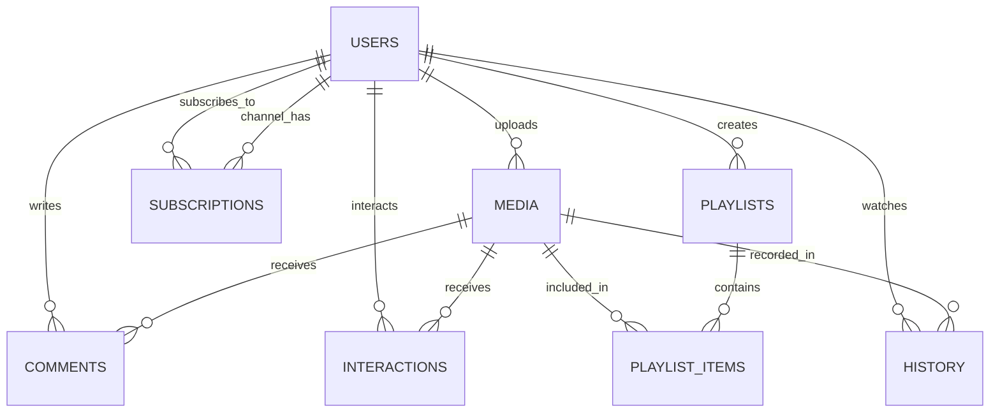

# Tài Liệu Kiến Trúc Back-End Chi Tiết - SyncPlay

Tài liệu này cung cấp cái nhìn chuyên sâu về kiến trúc, cơ sở dữ liệu và toàn bộ các API Endpoints của hệ thống Back-end SyncPlay.

---

## 1. Công Nghệ Sử Dụng (Technology Stack)
- **Core Framework**: FastAPI (Xử lý request bất đồng bộ tốc độ cao, tự động sinh tài liệu OpenAPI/Swagger, dependency injection cực kỳ linh hoạt).
- **Cơ sở dữ liệu**: Microsoft SQL Server (MSSQL).
- **Trình kết nối CSDL**: `pymssql` kết hợp với `SQLAlchemy` ORM để thao tác qua các Class Python (tuy nhiên hệ thống vẫn dùng Raw SQL cho các thao tác phức tạp hoặc thao tác cần bảo đảm hiệu năng / cascade).
- **Xác thực (Authentication)**: JSON Web Tokens (JWT) thông qua thư viện `python-jose` và `passlib` (dùng thuật toán mã hóa mật khẩu `bcrypt`).
- **Xử lý File**: Hỗ trợ Upload Video Local và Streaming theo dạng Chunked Transfer Encoding với `Range` headers.

---

## 2. Chi Tiết Các Bảng Trong Cơ Sở Dữ Liệu (Models Detail)

Sơ đồ ERD tổng quan:

### 2.1 Bảng `USERS` (Người dùng)
Lưu trữ thông tin xác thực và vai trò của người dùng.
- `UserID` (Integer): Khóa chính, tự động tăng.
- `Username` (String 255): Tên đăng nhập, UNIQUE (duy nhất).
- `PasswordHash` (String 255): Mật khẩu đã được mã hóa (Bcrypt).
- `IsAdmin` (Boolean): Đánh dấu quyền Quản trị viên (Mặc định `False`).
- `CreatedAt` (DateTime): Thời gian tạo tài khoản (Mặc định giờ hệ thống UTC).

### 2.2 Bảng `SYSTEM_SETTINGS` (Cấu hình hệ thống)
Lưu cấu hình hệ thống cấp quản trị dạng Key-Value để chỉnh sửa nóng mà không cần sửa code.
- `SettingKey` (String 50): Khóa chính (Ví dụ: `MaxTotalAccounts`, `MaxUploadsPerUser`).
- `SettingValue` (String 255): Giá trị của cấu hình.

### 2.3 Bảng `MEDIA` (Nội dung Đa phương tiện)
Lưu thông tin metadata cốt lõi về Video/Bài hát.
- `MediaID` (Integer): Khóa chính, tự động tăng.
- `UserID` (Integer): Khóa ngoại tham chiếu `USERS.UserID` (Chủ sở hữu đăng tải).
- `Title` (String 255): Tiêu đề của video/bài hát.
- `SourceType` (String 20): Nguồn của nội dung (`LOCAL`, `YOUTUBE`, `SPOTIFY`).
- `MediaResource` (String): Đường dẫn tới file (Nếu là LOCAL) hoặc đường dẫn Embed dạng iFrame (Nếu là Youtube/Spotify).
- `ViewsCount` (Integer): Số lượt xem (Mặc định 0).
- `UploadDate` (DateTime): Thời gian upload.
- `Category` (String 100): Thể loại nhạc (Pop, Rap, EDM, v.v.).
- `Author` (String 255): Tên ca sĩ / Tác giả trình bày.

### 2.4 Bảng `COMMENTS` (Bình luận)
- `CommentID` (Integer): Khóa chính.
- `MediaID` (Integer): Khóa ngoại tham chiếu `MEDIA.MediaID`.
- `UserID` (Integer): Khóa ngoại tham chiếu người viết `USERS.UserID`.
- `Content` (String): Nội dung chi tiết của bình luận.

### 2.5 Bảng `INTERACTIONS` (Tương tác Like/Dislike)
Bảng trung gian thể hiện tương tác của người dùng đối với media cụ thể.
- `UserID` (Integer): Khóa ngoại `USERS.UserID` (Khóa chính thứ 1).
- `MediaID` (Integer): Khóa ngoại `MEDIA.MediaID` (Khóa chính thứ 2).
- `IsLike` (Boolean): `True` có nghĩa là Like, `False` có nghĩa là Dislike.

### 2.6 Bảng `SUBSCRIPTIONS` (Đăng ký kênh)
Quản lý luồng theo dõi (Follow) giữa người dùng và kênh.
- `SubscriberID` (Integer): Người đi đăng ký kênh (`USERS.UserID`) - Khóa chính thứ 1.
- `ChannelID` (Integer): Kênh được đăng ký (`USERS.UserID`) - Khóa chính thứ 2.

### 2.7 Bảng `PLAYLISTS` & `PLAYLIST_ITEMS` (Danh sách phát)
- **`PLAYLISTS`**: 
  - `PlaylistID` (PK)
  - `UserID` (FK): Người sở hữu playlist.
  - `Name`: Tên danh sách phát.
  - `CreatedAt`: Ngày tạo.
- **`PLAYLIST_ITEMS`**: 
  - `PlaylistItemID` (PK)
  - `PlaylistID` (FK): Thuộc danh sách nào.
  - `MediaID` (FK): Trỏ tới bài hát nào.
  - `Position` (Integer): Thứ tự sắp xếp của bài hát trong playlist.

### 2.8 Bảng `HISTORY` (Lịch sử xem)
- `HistoryID` (PK)
- `UserID` (FK)
- `MediaID` (FK)
- `WatchedAt` (DateTime): Lịch sử thời điểm người dùng xem video đó.

---

## 3. Chi Tiết API Endpoints (API Specification)

### 3.1 Authentication (Xác thực)

#### `POST /api/auth/register`
- **Mục đích**: Đăng ký tài khoản người dùng mới.
- **Payload (Form Data)**: `username`, `password`.
- **Luồng xử lý**: 
  1. Truy vấn DB bảng `SYSTEM_SETTINGS` để kiểm tra biến `MaxTotalAccounts`.
  2. Block request nếu hệ thống đã đạt giới hạn số người đăng ký tối đa (thường được set bởi Admin).
  3. Kiểm tra tính trùng lặp `username` để tránh lỗi constraint CSDL.
  4. Băm mật khẩu (Hash) bằng `pwd_context.hash()`.
  5. Thêm user mới vào DB và commit.
- **Phản hồi**: `{"message": "User registered successfully", "user_id": 1}`.

#### `POST /api/auth/login`
- **Mục đích**: Đăng nhập và tạo JWT Token để giữ phiên.
- **Payload (OAuth2 Form)**: `username`, `password`.
- **Luồng xử lý**: 
  1. Tìm user theo username trong hệ thống.
  2. Verify mật khẩu hash bằng `pwd_context.verify(password_plain, password_hash)`.
  3. Nếu thành công, tạo chuỗi JWT Access Token (hết hạn sau 7 ngày) chứa ID / sub = username.
- **Phản hồi**: `{"access_token": "...", "token_type": "bearer", "user_id": 1, "username": "admin", "is_admin": true}`.

### 3.2 Media Management (Quản lý đa phương tiện)

#### `GET /api/media/trending`
- **Mục đích**: Lấy danh sách video ở trang chủ (Public API - Không cần JWT).
- **Parameters**: `search`, `category`, `sort` (`newest`, `most_viewed`, `most_liked`, `author_asc`, `author_desc`, `title_asc`, `title_desc`, `random`).
- **Luồng xử lý**: 
  - API phức tạp nhất dùng Query Builder của SQLAlchemy.
  - Sử dụng hàm `or_` và `ilike` để tìm kiếm chuỗi linh động (gộp cả search tiêu đề và ca sĩ).
  - Tối ưu subquery: Để sort theo số lượng Like, hệ thống dùng subquery gộp (`group_by`) bảng `INTERACTIONS` đếm like và outer join ngược lại với `MEDIA` kết hợp hàm `coalesce` xử lý Null.
  - Sử dụng logic `case()` SQL để đẩy các ca sĩ rỗng / trống (Null) xuống cuối danh sách khi user bấm sort theo tên.

#### `POST /api/media/upload` (Yêu cầu JWT)
- **Mục đích**: Upload trực tiếp file video định dạng MP4 từ máy khách.
- **Payload**: `title`, `category`, `author`, `file` (UploadFile multipart/form-data).
- **Luồng xử lý**:
  1. Chặn upload nếu User đạt giới hạn `MaxUploadsPerUser` trong cài đặt hệ thống.
  2. Dùng file object `wb+` lưu trực tiếp luồng stream vào thư mục vật lý `static/uploads/{filename}`.
  3. Lưu bản ghi vào bảng `MEDIA` với `SourceType="LOCAL"` và đường dẫn trỏ về `/static/uploads/...`.

#### `POST /api/media/link` (Yêu cầu JWT)
- **Mục đích**: Tải lên video dưới dạng Embed Link (YouTube / Spotify).
- **Payload**: `title`, `category`, `author`, `source_type`, `url`.
- **Luồng xử lý**:
  - Truyền chuỗi URL vào hàm xử lý Regex `extract_embed_url()`.
  - Nếu `YOUTUBE`: Tách tham số `?v=ID` và chuyển thành `https://www.youtube.com/embed/{video_id}`.
  - Nếu `SPOTIFY`: Tách tham số track ID và chuyển thành `https://open.spotify.com/embed/track/{track_id}`.
  - Lưu vào CSDL tương tự như Local media.

#### `GET /api/media/stream/{media_id}`
- **Mục đích**: Cơ chế truyền phát (Streaming) video chuẩn HTML5 cho các file `LOCAL`.
- **Luồng xử lý quan trọng**:
  - Dùng chuẩn `206 Partial Content`.
  - Nhận Header `Range: bytes=0-` từ trình duyệt của người dùng khi người dùng nhấn Play hoặc Tua nhanh.
  - Tính toán số byte bắt đầu (`byte1`) và kết thúc (`byte2`). Sau đó nhảy thẳng tới byte đó đọc dữ liệu: `f.seek(byte1)`.
  - Trả về Header `Content-Range`, `Content-Length`, và `Accept-Ranges: bytes`. Đây là công nghệ cốt lõi giúp thanh trượt video trên web có thể tua tùy ý không bị kẹt.

#### `DELETE /api/media/{media_id}` (Yêu cầu Chủ sở hữu hoặc Admin)
- **Mục đích**: Xóa media và cascade xóa các dữ liệu vệ tinh liên kết.
- **Luồng xử lý**:
  - Kiểm tra Auth: Chỉ người up video đó, hoặc người có cờ Admin mới được chạm vào.
  - Dùng hàm `os.remove` xóa file `.mp4` vật lý (Nằm trong try-except chống lỗi Crash do file mất/bị khóa).
  - Dùng cơ chế gỡ **Raw SQL cascading** thủ công: Gọi tuần tự các lệnh `DELETE FROM ... WHERE MediaID = :mid` qua các bảng `COMMENTS`, `INTERACTIONS`, `HISTORY`, `PLAYLIST_ITEMS` trước khi xóa root ở bảng `MEDIA`. Điều này tối ưu tốc độ và không gây lỗi FK rác cho CSDL SQL Server.

### 3.3 Tương tác (Likes, Subscribes, Comments)

#### `POST /api/interact/like` (Yêu cầu JWT)
- **Mục đích**: Đánh dấu Like hoặc Dislike cho bài hát.
- **Payload**: `media_id`, `is_like` (boolean).
- **Logic**: Backend code như một **nút Toggle thông minh**. Nếu tìm thấy record trong DB có cùng trạng thái (bạn đang Like, và ấn nút Like lần nữa) -> Xóa dòng record đó khỏi DB (Bỏ Like). Nếu khác trạng thái (bạn đang Like, mà ấn Dislike) -> Update trạng thái thành Dislike. Nếu chưa từng nhấn -> Insert DB mới.

#### `POST /api/subscribe` (Yêu cầu JWT)
- **Mục đích**: Đăng ký theo dõi (Follow) kênh người dùng khác.
- **Payload**: `channel_username`.
- **Logic**: Kiểm tra tránh tự lặp (Không cho phép user subscribe chính họ). Tương tự hàm Like, đây là hàm Toggle. Đã subscribe thì sẽ hủy bỏ (Unsubscribe).

#### `POST / PUT / DELETE /api/comments` (Yêu cầu JWT)
- **Mục đích**: Nhóm API Bình luận (Create, Update, Delete).
- **Logic**: Mọi thay đổi nội dung (PUT) hay xóa (DELETE) đều có một hàng rào bảo mật xác định user id từ Token có khớp với `UserID` lưu trong comment không. Riêng trường hợp DELETE, Admin có quyền ghi đè (override) để kiểm duyệt nội dung độc hại.

### 3.4 API Playlists (Danh sách phát)

#### Nhóm Endpoint `/api/playlists`
- **Mục đích**: Lưu trữ album riêng của cá nhân theo thời gian tạo mới nhất. Liên kết qua bảng N-N `PLAYLIST_ITEMS`.
- **Tính năng nổi bật**: Xóa playlist sẽ kèm thêm một Raw SQL statement tự động thả xóa (Drop) toàn bộ các phần tử `PLAYLIST_ITEMS` mang mã Playlist đó.

### 3.5 API Profile (Thống kê kênh)

#### `GET /api/profile/{username}`
- **Mục đích**: Dashboard Mini xuất dữ liệu báo cáo thống kê một kênh cụ thể.
- **Logic Tính Toán & Aggregation**:
  - Số lượng video upload: Lấy `.count()` từ bảng `MEDIA`.
  - Số người đăng ký kênh: Lấy `.count()` từ bảng `SUBSCRIPTIONS` dựa vào `ChannelID`.
  - Tổng số Views: Sử dụng truy vấn SQL tổng hợp `db.query(func.sum(Media.ViewsCount))` cộng dồn toàn bộ view từ các video của User đó.
  - Tổng Like/Dislike: Join truy vấn 2 bảng `Interaction` và `Media` lọc theo `IsLike = True/False` và `.count()`.

---

## 4. Các Hàm Helper Cốt Lõi (Core Internal Utilities)

- **`get_db()`**: Hàm Generator khai sinh một Session mới cho thao tác CSDL mỗi khi có request tới. Đảm bảo đóng phiên ở khối `finally` giúp kết nối đến SQL Server luôn được trả về pool mà không lo tràn (Memory Leak / Connection Timeout).
- **`create_access_token(data, expires_delta)`**: Chức năng định hình cấu trúc Payload Token, dán timestamp hết hạn (`exp`) và ký số xác thực chuẩn mã hóa `HS256` với `SECRET_KEY`.
- **`get_current_user()`**: **Dependency quan trọng nhất**. FastAPI gọi hàm này để chặn các Endpoint yêu cầu bảo mật. Chức năng giải mã JWT lấy username, đối chiếu database để trả về User hiện hành. Ném mã `401 Unauthorized` nếu sai token.
- **`get_current_admin()`**: Hàm wrapper (bọc quanh) `get_current_user` để kiểm tra thuộc tính `IsAdmin`. Dành riêng cho Endpoint hệ thống quản trị.

---

## 5. Thiết kế Tối Ưu Hiệu Năng & Bảo Mật Nâng Cao
1. **No Plain-Text Passwords**: Mật khẩu mã hóa **bcrypt** kèm salt ngẫu nhiên, miễn nhiễm với tấn công từ điển (Rainbow table attack).
2. **Stateless Authentication**: Sử dụng JWT để server không cần duy trì bộ nhớ Cookie (Session state), điều này giúp server dễ mở rộng (scale) không lỗi.
3. **Chunked Local Streaming Mượt Mà**: Backend **không đọc toàn bộ tệp MP4** vào bộ nhớ RAM. File Object `.read(chunk_size)` kết hợp Iterator `yield` theo chu kỳ để buffer stream mượt mà tới các Client có cấu hình mạng thấp, đồng thời chống lỗi **OOM (Out of Memory)** khi nhiều người cùng xem file nặng.
4. **An Toàn Foreign Key Constraints**: Hạn chế sử dụng `cascade="all, delete-orphan"` từ config của SQLAlchemy - thứ thường gây khó gỡ lỗi hoặc xóa bay dữ liệu lan truyền rủi ro cao. Back-end tại đây luôn chủ động làm sạch các tham chiếu liên kết qua RAW SQL trước khi xóa dòng chính. Thể hiện quyền kiểm soát chặt chẽ của lập trình viên.
